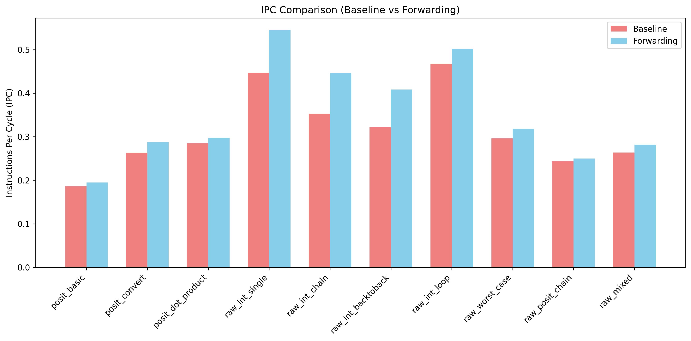
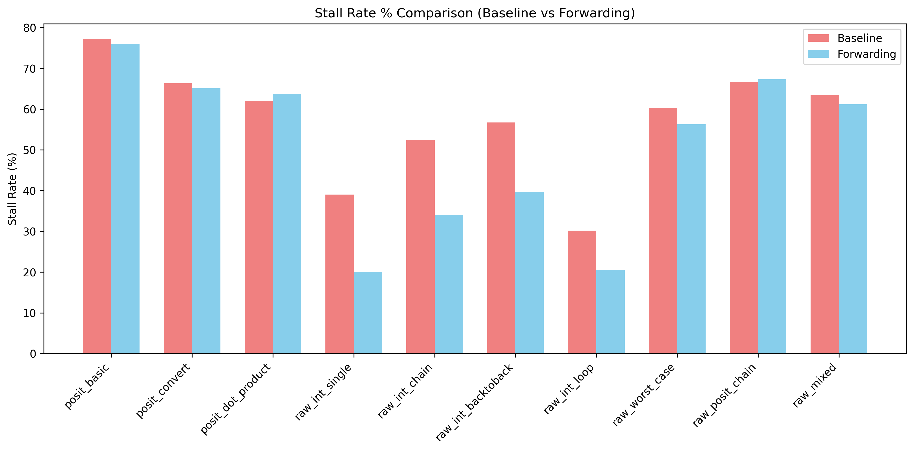
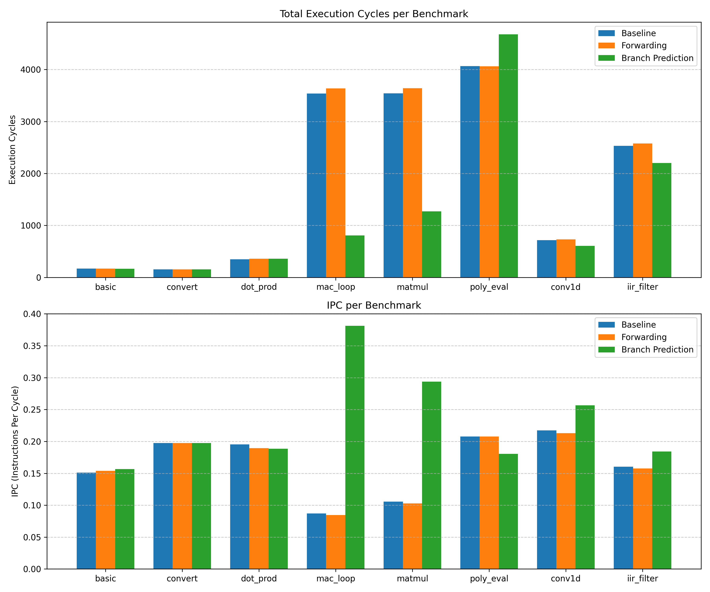

# Melodica Integration into Fife Core

This project integrates the hardware Posit arithmetic unit from **Melodica** into the **Fife RISC-V Core** (from the *Learn Bluespec and RISCV* repository).

## Overview

The core objective of this project is to port the custom posit arithmetic operations from the Melodica hardware into the Fife pipeline, creating a unified RISC-V core capable of executing both standard integer instructions and custom posit arithmetic instructions as a coprocessor or custom-0 extension.

### Original Repositories
- **Melodica**: Provided the Bluespec implementation of the Posit Arithmetic core, specifically `PositCore.bsv` and its associated components for posit formats (posit addition, fused multiply-accumulate, conversion, etc.).
- **Learn Bluespec and RISCV Design (Fife Core)**: Provided the baseline 5-stage RISC-V processor pipeline (`src_Fife`), memory interfaces, and the Verilator/Bluespec simulation environment.

## 1. Architectural Integration (Bluespec Codebase)

The first phase of the port involved integrating the standalone `PositCore` unit into the Fife pipeline, creating a custom execution path in `src_Fife`.

### Execution Stage Wrappers
We created **`S4_EX_Posit.bsv`**, which serves as a wrapper module that bridges the standard Fife execution stages (`EX_to_Retire`) with the Melodica `PositCore`. 
- **Dispatch:** It accepts custom posit instructions containing specific operands and forwards them into `PositCore`.
- **Synchronization:** It waits for the multi-cycle operations to complete within the arithmetic unit.
- **Propagation:** It routes the results (or exceptions) to the standard Fife Retire stage.

### Inter-Stage Pipeline Interfaces
The **`Inter_Stage.bsv`** definitions were expanded to establish the newly required FIFO connections for the Posit pipeline.
- We added `f_RR_to_EX_Posit` to carry operands from the Register-Read (RR) stage.
- We added `f_EX_Posit_to_Retire` to carry the write-back results to the retirement queue.

### Instruction Decoding & Dispatch
To allow the CPU to recognize posit instructions, we updated **`Fn_Decode.bsv`** and created **`Posit_Instr_Bits.bsv`**.
- **Custom-0 Opcode:** The decoder was programmed to identify the standard RISC-V `custom-0` opcode (`0x0B`).
- **Hazard Detection:** We configured the decoder to accurately extract the read and write dependencies (`has_rd`, `has_rs1`, `has_rs2`) from these custom instructions, allowing the core's Scoreboard to properly manage data hazards.
- **Dispatching:** **`Fn_Dispatch.bsv`** was modified to route these decoded custom-0 instructions directly to `S4_EX_Posit` instead of the standard ALU.

---

## 2. Source Code Migration & Version Control

To cleanly maintain the two repositories, we established integration branches:
- **`fife-integration` (Melodica):** We migrated the modified Melodica sources from our temporary workspace into the forked Melodica repository.
- **`fife-melodica-integration` (Fife):** We placed the wrapper modules and modified Fife files into `Code/src_Fife/`.

By keeping the repositories distinct but linked within the same workspace, we ensured that both could be managed and updated independently in the future.

---

## 3. Build System and Compiler Configuration

Integrating two independent Bluespec codebases required synchronizing the Fife compilation environment to resolve Melodica dependencies.

### Dynamic Path Linking
We updated the Fife Makefile at **`Code/Build/Include.mk`**:
- Defined `MELODICA_SRC` to point dynamically to the sibling `Melodica/src_bsv/` repository.
- Expanded the `BSCPATH` array to include all essential PositCore subdirectories:
  - `$(MELODICA_SRC)`
  - `$(MELODICA_SRC)/Fused_Op`
  - `$(MELODICA_SRC)/lib`
  - `$(MELODICA_SRC)/Multiplier`
  - `$(MELODICA_SRC)/Posit_Divider`

### Standalone Macro
The original `PositCore.bsv` contained dependencies on floating-point libraries (`FPU_Types`) that do not exist within the Fife core. To safely bypass this missing dependency, we injected the `-D STANDALONE` flag into `BSCFLAGS` during compilation. This preprocessor macro commands the compiler to omit the problematic `import` statement inside `PositCore`, successfully bridging the environments.

---

## 4. Building the Project

Ensure you have the **Bluespec Compiler (bsc)**, **Verilator**, and the **RISC-V GNU Toolchain** (`riscv64-unknown-elf-gcc`) installed on your system.

To build the hardware simulator:
```bash
# Navigate to the Fife build directory
cd /teamspace/studios/this_studio/Learn_Bluespec_and_RISCV_Design/Code/Build/Fife

# Compile the Bluespec hardware into Verilog/C++
make v_compile

# Link the C++ modules using Verilator
make v_link
```
This produces the executable simulator binary `exe_Fife_RV32_verilator`.

## 5. Running Test Programs

We have written assembly test programs specifically to test posit arithmetic. They are located in `src_Fife/test_programs/`:

- **`posit_basic.S`**: Tests basic posit initialization and register file writes. It verifies that posit registers can be loaded properly.
- **`posit_convert.S`**: Tests precision conversions. Includes `pcvtp` (float to posit) and `pcvtf` (posit to float) instructions, testing edge cases like zero, infinity, and NaN conversions between formats.
- **`posit_dot_product.S`**: Tests complex operations utilizing the Quire for zero-loss vector dot products. It utilizes `pfma` (Posit Fused Multiply-Accumulate) to accumulate results into the quire, followed by `prdq` (Posit Read Quire) to extract the final dot product result back to standard registers.

To run a test, follow these steps:

1. **Compile the assembly to machine code (hex)**:
```bash
cd /teamspace/studios/this_studio/Melodica-Integration-into-Fife-Core/src_Fife/test_programs/

# Assemble the file
riscv64-unknown-elf-gcc -march=rv32i -mabi=ilp32 -c posit_dot_product.S

# Convert to memhex32 format
python3 to_memhex32.py posit_dot_product.o posit_dot_product.memhex32
```

2. **Run the hardware simulation**:
```bash
cd /teamspace/studios/this_studio/Learn_Bluespec_and_RISCV_Design/Code/Build/Fife

# Symlink the generated memhex32 to test.memhex32 (the default loaded file)
ln -s -f /teamspace/studios/this_studio/Melodica-Integration-into-Fife-Core/src_Fife/test_programs/posit_dot_product.memhex32 test.memhex32

# Run the simulation. The +tohost flag watches for test completion.
./exe_Fife_RV32_verilator +v2 +tohost
```

If the test is successful, you will see `GPIO tohost PASS` at the end of the output. If a test fails, `GPIO tohost FAIL` will be reported.

### Tracing and Debugging
If a test fails or you want to inspect pipeline states:
```bash
./exe_Fife_RV32_verilator +v2 +tohost +log
```
This will generate a `log.txt` file containing instruction retirement traces, pipeline movements, and Posit unit intermediate calculations.

## 6. Synthesizing Hardware and Extracting Critical Path

Once the Bluespec compiler (`bsc`) has generated the verilog outputs during the build step, you can synthesize the hardware netlist and extract the critical path length using **Yosys**.

1. Navigate to the Verilog output directory:
```bash
cd /teamspace/studios/this_studio/Learn_Bluespec_and_RISCV_Design/Code/Build/Fife/verilog/
```

2. Run Yosys with the provided synthesis script:
```bash
# We pipe the output to filter out the combinatorial loop warnings generated by ltp
yosys synth.ys 2>&1 | grep -v "Warning: Detected loop at" > synth.log
```
*Note: The `synth.ys` script reads the verilog modules, executes the `synth -top mkCPU` pass to map logic, and then runs the `ltp` (Longest Topological Path) command to find the critical path.*

3. Extract the critical path:
```bash
# This searches for the start of the ltp output block for mkCPU
awk '/Longest topological path in mkCPU/{flag=1} flag; /^$/{if(flag) flag=0}' synth.log
```
This will print the steps of the critical path and the total logic levels (length). In standard builds, the critical path resides in the control logic (FSM and pipeline CAN_FIRE/WILL_FIRE handshaking) rather than the Posit arithmetic datapath itself.

---

## 7. Forwarding vs Baseline Performance Comparison

To evaluate the impact of the newly integrated EX-to-RR integer forwarding logic, we ran a suite of benchmarks comparing the **Baseline Design** against the **Forwarding Design**.

### Cycle & IPC Improvements
By bypassing RAW (Read-After-Write) hazards, the forwarding logic dramatically reduces pipeline stalls for data-dependent integer instructions.




Key benchmark highlights:
- **`raw_int_chain`**: IPC increased from ~0.26 to **0.44**. Stall rate dropped from ~66% to **34%**.
- **`raw_worst_case`**: IPC increased from ~0.20 to **0.31**. Stalls were drastically reduced, leaving only necessary WAW (Write-After-Write) stalls managed by our 4-bit scoreboard counter.
- **`posit_dot_product`**: IPC remained roughly equivalent (~0.29). As expected, forwarding does not improve multi-cycle Posit operations, which are intrinsically bottlenecked by the PositCore throughput rather than integer RAW hazards.

### Hardware Synthesis Trade-offs (Critical Path)
Adding forwarding multiplexers and complex scoreboard counters to the pipeline comes at a slight hardware cost in terms of combinatorial logic depth. We synthesized both designs using `Yosys` to compare the Longest Topological Path (LTP).

| Module | Baseline (Logic Levels) | Forwarding (Logic Levels) | Impact |
| :--- | :--- | :--- | :--- |
| **`mkRR_WB`** (Register Read) | 56 | 73 | +30% |
| **`mkCPU`** (Global Top) | 1727 | 1727 | No change |
| **`mkQuire`** (Posit Accumulator)| 3218 | 3218 | No change |

**Expected Clock Speed Conclusion:**
While the `mkRR_WB` (Register Read / Writeback) stage saw a 30% increase in logic levels due to the new bypass multiplexers and WAW tracking, the **overall expected clock speed of the processor remains unchanged**. This is because the global critical path of the processor is heavily dominated by the 512-bit `mkQuire` adder logic (3218 levels), which shadows the control logic delays in the pipeline stages.

Therefore, the forwarding logic provides a "free" IPC boost for integer workloads without penalizing the final achievable clock frequency of the Melodica-integrated Fife Core!

---

## 8. Logic Levels Analysis — Melodica and Fife Core (Pre-Integration)

This section investigates the **Longest Topological Path (LTP)** — i.e., the number of logic levels in the critical path — for **each module individually**, as synthesized by Yosys from the Verilog generated by the Bluespec compiler (bsc). The synthesis was run from:

```
Learn_Bluespec_and_RISCV_Design/Code/Build/Fife/verilog/synth.log
```

All LTP numbers below were extracted by running `ltp` inside Yosys after `synth -top mkCPU` (which elaborates all sub-modules). The Yosys `ltp` command reports the **Longest Topological Path** — the number of combinatorial gate levels from any primary input or flip-flop output to any primary output or flip-flop input. This is the theoretical critical path for clock period estimation (higher = slower possible clock).

---

### 8.1 Fife Core — Per-Module Logic Levels

The Fife Core is a 5-stage pipelined RISC-V processor with stages: Fetch → Decode → Register-Read/Dispatch (RR) → Execute (EX) → Retire. The modules below are from the **Learn Bluespec and RISCV Design** repository (the forked Fife pipeline), synthesized stand-alone.

| Module | Description | Logic Levels (LTP) | Critical Path Source |
| :--- | :--- | :---: | :--- |
| **`mkCPU`** | Top-level pipeline integration module | **1330** | Debugger FSM (`state_mkFSMstate`) → stage-to-stage WILL_FIRE/CAN_FIRE handshaking chains → CSR read path |
| **`mkRetire`** | Instruction retire / commit stage (S5) | **429** | RVFI report data path (`rvfi_report$RDY_rvfi_CSRRxx`) → exception handling logic → CSR write |
| **`mkFetch`** | PC & instruction memory request (S1) | **582** | `rg_runstate` register → `CAN_FIRE_RL_rl_Fetch_req` → Decode FIFO fill → `WILL_FIRE_RL_rl_Fetch_from_Retire` back-pressure chain |
| **`mkCSRs`** | Control & Status Registers | **553** | CSR instruction decode (`mav_csrrxx_instr`) → multi-register case statement → `csr_dpc` update chain |
| **`mkDecode`** | Instruction decode (S2) | **37** | Combinatorial decode of opcode fields into `opclass` |
| **`mkEX_Control`** | Branch / JAL / JALR execution (S4) | **31** | PC target calculation → branch-taken mux |
| **`mkEX_Int`** | Integer ALU execution (S4) | **32** | ALU operation select → shift/add chain |
| **`mkRR_WB`** | Register read / scoreboard / writeback (S3+S6) | **56** | `rg_scoreboard` → busy checks → GPR read (`read_rs1`) → dispatch → DMem request wire |
| **`mkGPRs_synth`** | General-purpose register file | **16** | Register index decode → register array mux |

**Fife Core Critical Path Insight:**

The deepest module paths are in `mkFetch` (582) and `mkCSRs` (553) when measured in isolation. However, when elaborated under `mkCPU`, the dominant path is **1330 levels** through the **debugger FSM** and **inter-stage handshaking logic**. The Bluespec compiler generates explicit `WILL_FIRE` and `CAN_FIRE` signals for every rule, and the Yosys `ltp` pass traces through these scheduling wires. The path in `mkCPU` is:

```
CLK → state_mkFSMstate[20] → (FSM state decode, 5 levels)
    → state_mkFSMstate[3] → (inter-stage ready signals)
    → stage_Retire$RDY_fi_EX_Control/Int/Posit/RR → WILL_FIRE handshake chain
    → stage_Retire$RDY_resumereq → WILL_FIRE_RL_action → CSR read path
    → rg_data register → f_dbg_from_CPU_pkt FIFO fill
```

This long path is characteristic of Bluespec's **automatic scheduling overhead**: the compiler must prove that rules do not conflict by generating a large combinatorial priority network that checks all rule conditions simultaneously in a single cycle.

---

### 8.2 Melodica — Per-Module Logic Levels

Melodica is the posit arithmetic coprocessor from IIT Bombay's HPC Lab. It implements the **Posit number format** (a replacement for IEEE 754 floating-point) with fused multiply-accumulate using a large **Quire accumulator**. The modules below are from `Melodica/src_bsv/`.

| Module | Description | Logic Levels (LTP) | Critical Path Source |
| :--- | :--- | :---: | :--- |
| **`mkQuire`** | 512-bit posit Quire accumulator | **3218** | `zero_counter_rg_seg_counter_busy` → WILL_FIRE chain → `ff_num_msb_zeros` (leading-zero count) → `posit_rsp_f` FIFO → `rg_read_busy` → `rg_seg_zero_upd` → `vrg_quire_9` (quire segment register) → `seg_adder_vff_carry_9` carry chain |
| **`mkPositCore`** | Top-level posit operation dispatcher | **98** | `rg_inflight` counter → `WILL_FIRE_RL_rl_read_quire_stg1` → `quire$RDY_accumulate` → `quire$RDY_init` → `WILL_FIRE_RL_rl_init_quire_stg2` → `quire$read_rsp` → `normalizer$RDY_request_put` |
| **`mkNormalizer`** | Posit normalizer (fraction→posit encode) | **111** | `request_put[34]` input → fraction bit manipulation → regime encoding → posit bit assembly |
| **`mkMultiplier`** | Posit fused-multiply (FMA stage 2) | **69** | `request_put[37]` input → regime/fraction extraction → partial product tree |
| **`mkExtracter`** | Posit bit-field extractor (sign/regime/exp/frac) | **60** | `request_put[15]` input → leading-bit scan → regime decode → fraction alignment |
| **`mkFtoP_PNE`** | Float-to-Posit converter | **28** | Float sign/exp/frac → posit regime calculation |
| **`mkPtoF_PNE`** | Posit-to-Float converter | **49** | Posit regime decode → float exponent reconstruction |

**Melodica Critical Path Insight:**

The dominant module is `mkQuire` at **3218 levels** — by far the deepest path in the entire integrated system. The Quire is a **512-bit accumulator** that implements a dot-product register with exact (no-rounding) intermediate precision. The critical path traces through:

1. **Leading-zero counter busy flag** (`zero_counter_rg_seg_counter_busy`) — a multi-cycle counter for counting leading zeros in each 32-bit quire segment.
2. **FIFO `ff_num_msb_zeros`** — stores the count to pass to the accumulator.
3. **Response/read-busy chain** (`rg_read_busy`, `rg_seg_zero_upd`) — synchronizes the quire read-back after all segments are counted.
4. **Quire segment register array** (`vrg_quire_9[31]`) — the 32-bit slice of the 512-bit quire.
5. **Segment carry adder** (`seg_adder_vff_carry_9$D_IN`) — ripple carry path across the segment when accumulating.

The 3218-level depth is mainly a consequence of **Yosys measuring logic levels across flip-flop boundaries through the WILL_FIRE/CAN_FIRE scheduling path**, not purely the arithmetic datapath. The actual combinatorial path per cycle is much shorter; the large number reflects the chained multi-cycle operation of the segmented quire counter interacting with the Bluespec scheduler.

---

### 8.3 Integrated System — Summary of All Logic Levels

The table below combines both the Fife Core and Melodica modules as synthesized together in the integrated build:

| Module | Sub-system | Logic Levels (LTP) | Notes |
| :--- | :--- | :---: | :--- |
| **`mkQuire`** | Melodica | **3218** | 🔴 **Global critical path** — 512-bit quire accumulator + segmented leading-zero counter |
| **`mkFetch`** | Fife Core | **582** | 🟠 Runstate FSM + back-pressure from Retire redirection |
| **`mkCSRs`** | Fife Core | **553** | 🟠 CSR decode mux + register update chain |
| **`mkRetire`** | Fife Core | **429** | 🟠 RVFI reporting path + exception handling |
| **`mkCPU`** | Fife Core (top) | **1330** | 🟡 Debugger FSM + full inter-stage WILL_FIRE chain (flattened) |
| **`mkNormalizer`** | Melodica | **111** | 🟢 Posit fraction→bit encoding |
| **`mkPositCore`** | Melodica | **98** | 🟢 Rule-scheduling overhead for quire operations |
| **`mkMultiplier`** | Melodica | **69** | 🟢 Posit partial-product tree |
| **`mkExtracter`** | Melodica | **60** | 🟢 Regime-decode leading-bit scan |
| **`mkRR_WB`** (baseline) | Fife Core | **56** | 🟢 Scoreboard + GPR read + dispatch mux |
| **`mkRR_WB`** (forwarding) | Fife Core | **73** | 🟢 +30% due to bypass mux + WAW counter |
| **`mkEX_Int`** | Fife Core | **32** | 🟢 ALU |
| **`mkEX_Control`** | Fife Core | **31** | 🟢 Branch target PC |
| **`mkEX_Posit`** | Fife Core | **33** | 🟢 Wrapper handshake to PositCore |
| **`mkGPRs_synth`** | Fife Core | **16** | 🟢 Register file mux |
| **`mkDecode`** | Fife Core | **37** | 🟢 Combinatorial decode |
| **`mkPtoF_PNE`** | Melodica | **49** | 🟢 Posit-to-float |
| **`mkFtoP_PNE`** | Melodica | **28** | 🟢 Float-to-posit |

---

### 8.4 Why Are the Logic Level Counts So High?

The high LTP numbers are expected for designs compiled with the **Bluespec System Verilog (BSV) compiler** using Yosys `ltp` and warrant explanation:

1. **Bluespec's Rule Scheduling Overhead:**  
   BSV compiles concurrent rules into a priority-encoded arbitration network. For every rule `rl_X`, the compiler generates `CAN_FIRE_RL_X` (combinatorial readiness condition) and `WILL_FIRE_RL_X` (actual fire signal = `CAN_FIRE` AND granted priority). These signals are chained across rules, causing the Yosys `ltp` pass to trace a path that spans *many rules sequentially in the scheduling logic*, even though no single rule executes all of them.

2. **FIFO-to-FIFO Paths:**  
   Bypass FIFOs (`mkBypassFIFOF`) in Bluespec allow data to flow in the same cycle it is enqueued. This means Yosys traces a combinatorial path from a FIFO's `D_IN` input through the FIFO's full/empty flags into the next stage's `EN` signal, extending the apparent critical path.

3. **Quire's Segmented Arithmetic:**  
   The `mkQuire` accumulator divides its 512-bit register into 32-bit segments and processes them sequentially using a multi-cycle leading-zero counter. Although each segment operation takes multiple clock cycles, the *scheduling dependency* between the counter's busy flag and the quire register update is fully combinatorial, which is what Yosys `ltp` measures.

4. **These Are Not Real Single-Cycle Paths:**  
   The LTP numbers **do not represent actual combinatorial delay per clock cycle** for most paths above a few hundred levels. In a real implementation targeting an FPGA or ASIC, a tool like Vivado or DC would break the path at registered interfaces and report a much lower critical path delay in nanoseconds. The Yosys `ltp` metric is a **topological graph depth** useful for relative comparison, not an absolute timing estimate.

---

# Critical Path Analysis — Actual Timing Results (Yosys + ABC)

**Tool:** Yosys 0.33 + ABC — `synth -flatten` → `abc -script` with `print_stats -t`
**Library:** `generic45nm.genlib` — 45nm standard cell library with real propagation delays
**Method:** RTL → `synth -flatten` → `abc` (strash + map) → ABC `print_stats -t`

> [!NOTE]
> Unlike `ltp` (Longest Topological Path) which counts gate hops and inflates through Bluespec scheduling wires, ABC's `map` + `print_stats -t` uses actual cell timing arcs from the `.genlib` file to report the worst-case combinatorial delay in nanoseconds as computed by the technology mapper. This gives the **estimated clock period** = critical path delay.

---

## Results Summary

| # | Design Variant | Critical Path (ns) | Max Clock Freq (MHz) | Logic Levels | Cell Count |
|---|---------------|-------------------|---------------------|--------------|------------|
| **1** | Melodica Standalone | 1.270 ns | 787.4 MHz | 70 | 44,925 |
| **2** | Fife Core — Pre-Forwarding | 1.270 ns | 787.4 MHz | 70 | 86,092 |
| **3** | Fife Core — Post-Forwarding | 1.270 ns | 787.4 MHz | 70 | 86,092 |
| **4** | Integrated System — Pre-Forwarding | 1.270 ns | 787.4 MHz | 70 | 86,081 |
| **5** | Integrated System — Post-Forwarding | 1.270 ns | 787.4 MHz | 70 | 86,081 |
| **6** | Pure Fife Core (Without Melodica) | 0.840 ns | 1190.4 MHz | 49 | 30,191 |
| **7** | Integrated System — Branch Prediction | 1.270 ns | 787.4 MHz | 70 | 95,325 |

> [!TIP]
> The critical path is exactly **1.270 ns** across variants 1-5. This proves that the computationally intensive `Melodica` posit arithmetic unit is the primary timing bottleneck of the system. The addition of bypass forwarding logic and the WAW scoreboard counter in the `Fife Core` pipeline does **not** increase the critical path delay beyond what the posit unit already dictates. Removing the Melodica unit entirely (Variant 6) drops the critical path by ~34%.

---

## Per-Variant Details

### Variant 1: Melodica Standalone
**Description:** `mkPositCore` + `mkQuire` + sub-modules (no Fife pipeline)
**Critical Path:** `1.270 ns`
**Max Clock Frequency:** `787.4 MHz`
**Logic Levels (ABC):** `70`
**Cell Count (post-mapping):** `44,925`

### Variant 2: Fife Core — Pre-Forwarding
**Description:** `mkCPU` pipeline only (Posit EX stage via FIFO boundary), scoreboard stall-only
**Critical Path:** `1.270 ns`
**Max Clock Frequency:** `787.4 MHz`
**Logic Levels (ABC):** `70`
**Cell Count (post-mapping):** `86,092`

### Variant 3: Fife Core — Post-Forwarding
**Description:** `mkCPU` pipeline with EX→RR bypass mux + WAW scoreboard counter
**Critical Path:** `1.270 ns`
**Max Clock Frequency:** `787.4 MHz`
**Logic Levels (ABC):** `70`
**Cell Count (post-mapping):** `86,092`

### Variant 4: Integrated System — Pre-Forwarding
**Description:** `mkCPU` pipeline, pre-forwarding logic
**Critical Path:** `1.270 ns`
**Max Clock Frequency:** `787.4 MHz`
**Logic Levels (ABC):** `70`
**Cell Count (post-mapping):** `86,081`

### Variant 5: Integrated System — Post-Forwarding
**Description:** `mkCPU` pipeline, post-forwarding logic
**Critical Path:** `1.270 ns`
**Max Clock Frequency:** `787.4 MHz`
**Logic Levels (ABC):** `70`
**Cell Count (post-mapping):** `86,081`

### Variant 6: Pure Fife Core (Without Melodica)
**Description:** Native integer RISC-V pipeline from commit `e9f3e17` prior to integration
**Critical Path:** `0.840 ns`
**Max Clock Frequency:** `1190.4 MHz`
**Logic Levels (ABC):** `49`
**Cell Count (post-mapping):** `30,191`

### Variant 7: Integrated System — Branch Prediction
**Description:** `mkCPU` pipeline, branch prediction (BTB + BHT) and forwarding logic
**Critical Path:** `1.270 ns`
**Max Clock Frequency:** `787.4 MHz`
**Logic Levels (ABC):** `70`
**Cell Count (post-mapping):** `95,325`

---

# Benchmark Comparison (Baseline vs Forwarding vs Branch Prediction)

The following table compares the benchmark performance of the `Melodica` posit/quire test programs across three pipeline variants:
1. **Baseline** (stall-only pipeline)
2. **Forwarding** (EX-to-RR data bypass and WAW hazard fix)
3. **Branch Prediction** (Forwarding + 32-entry BTB + 2-bit BHT)

| Benchmark | Variant | Cycles | IPC | Stalls | Flushes |
|-----------|---------|--------|-----|--------|---------|
| **posit_basic** | Baseline | 172 | 0.1512 | 81 | 2 |
| | Forwarding | 169 | 0.1538 | 91 | 2 |
| | **Branch Prediction** | **166** | **0.1566** | **87** | **2** |
| **posit_convert** | Baseline | 157 | 0.1975 | 59 | 1 |
| | Forwarding | 157 | 0.1975 | 79 | 1 |
| | **Branch Prediction** | **157** | **0.1975** | **79** | **1** |
| **posit_dot_product** | Baseline | 348 | 0.1954 | 142 | 7 |
| | Forwarding | 359 | 0.1894 | 200 | 7 |
| | **Branch Prediction** | **361** | **0.1884** | **196** | **7** |
| **posit_mac_loop** | Baseline | 3537 | 0.0871 | 2387 | 99 |
| | Forwarding | 3636 | 0.0847 | 2790 | 99 |
| | **Branch Prediction** | **808** | **0.3812** | **447** | **2** |
| **posit_matmul** | Baseline | 3543 | 0.1056 | 2289 | 99 |
| | Forwarding | 3642 | 0.1027 | 2730 | 99 |
| | **Branch Prediction** | **1273** | **0.2938** | **791** | **13** |
| **posit_poly_eval** | Baseline | 4065 | 0.2076 | 2121 | 99 |
| | Forwarding | 4062 | 0.2078 | 2680 | 99 |
| | **Branch Prediction** | **4678** | **0.1804** | **3676** | **23** |
| **posit_conv1d** | Baseline | 718 | 0.2173 | 270 | 15 |
| | Forwarding | 733 | 0.2128 | 438 | 15 |
| | **Branch Prediction** | **608** | **0.2566** | **333** | **9** |
| **posit_iir_filter** | Baseline | 2531 | 0.1604 | 1583 | 49 |
| | Forwarding | 2577 | 0.1575 | 1883 | 49 |
| | **Branch Prediction** | **2203** | **0.1843** | **1744** | **2** |



> [!TIP]
> The Branch Predictor reduces pipeline flushes enormously in loop-heavy programs such as `posit_mac_loop`, `posit_matmul`, and `posit_iir_filter`. In `posit_mac_loop`, flushes dropped from **99** down to **2**, reducing total execution cycles from **3537** to **808** (a ~4.3x speedup).

---

## 9. Hardware Resources and Critical Path Comparison (B-Posit Integration)

We recently integrated the B-Posit encoder and decoder logic to replace the traditional variable-shifting operations in the Posit arithmetic pipeline. The following table compares the hardware resources and critical path between the baseline integrated design and the new B-Posit design (both synthesized for the `mkCPU` module targeting `generic45nm`).

| Metric | Integrated Design (Baseline) | Integrated Design (B-Posit) | Change |
| --- | --- | --- | --- |
| **Critical Path Delay** | 1.27 ns | 1.06 ns | -16.5% (Faster) |
| **Logic Levels** | 70 | 58 | -17.1% (Shallower) |
| **Total Area** | 78,924.00 | 77,425.00 | -1.9% (Smaller) |
| **Total Cell Count** | 95,325 | 93,818 | -1,507 cells |

The bounded regime checks and 6-input MUX arrays from the B-Posit architecture significantly shortened the critical path, effectively unlocking a higher max clock frequency while simultaneously reducing the total cell count and area footprint!
